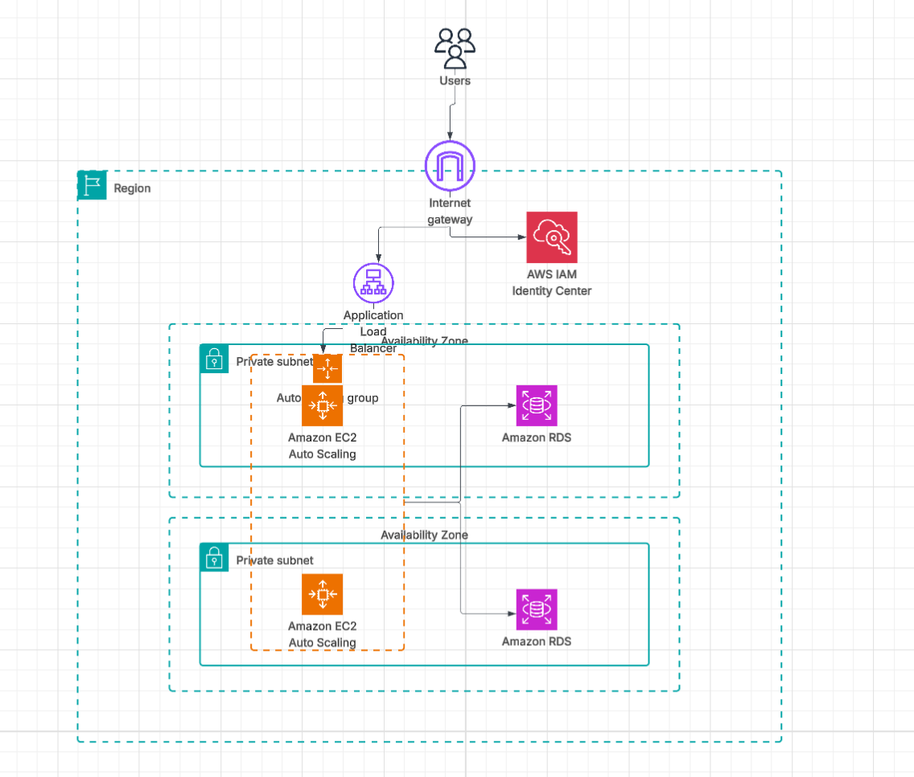

# Project 1: Scalable Web Application with ALB and Auto Scaling

## Description

This project involves deploying a simple, scalable, and highly available web application on AWS using EC2 instances. The architecture ensures resilience by distributing traffic with an Application Load Balancer (ALB) and automatically adjusting capacity with an Auto Scaling Group (ASG) based on demand . This setup demonstrates best practices for compute scalability, security, and cost optimization .

## Architecture Diagram

## Key AWS Services Used

* **Amazon EC2:** Provides virtual server instances to host the web application.
* **Application Load Balancer (ALB):** Automatically distributes incoming application traffic across multiple EC2 instances.
* **Auto Scaling Group (ASG):** Ensures the application has the correct number of EC2 instances available to handle the load.
* **IAM:** Uses role-based access to securely provide permissions to the EC2 instances without storing credentials.
* **CloudWatch:** Monitors the performance metrics of the instances, like CPU utilization, to trigger scaling policies.

## Deployment Steps

1.  **Security Group:** A security group (`WebApp-SG`) was created to act as a virtual firewall, allowing HTTP traffic from the internet.
2.  **IAM Role:** An IAM role (`EC2-WebApp-Role`) was established to grant secure permissions to the EC2 instances.
3.  **Launch Template:** A launch template (`WebApp-Template`) was configured with an Amazon Linux 2 AMI, `t2.micro` instance type, and a user data script to bootstrap the instances with an Apache web server.
4.  **ALB and Target Group:** An internet-facing Application Load Balancer and a target group (`WebApp-TG`) were set up to route and health-check traffic to the instances.
5.  **Auto Scaling Group:** An Auto Scaling Group (`WebApp-ASG`) was created to maintain a desired capacity of 2 instances, with the ability to scale up to 4 instances if the average CPU utilization exceeds 50%.

## Testing and High Availability

* **Live URL:** The application can be accessed via the ALB's DNS name.
* **High Availability Test:** By manually terminating one of the running EC2 instances, the Auto Scaling Group automatically provisions a new, healthy instance to replace it, demonstrating the self-healing and resilient nature of the architecture.

## Learning Outcomes

* Successfully set up a secure and scalable EC2-based web application.
* Implemented high availability using an Application Load Balancer and an Auto Scaling Group across multiple Availability Zones
* Configured Auto Scaling policies to optimize costs and performance based on real-time metrics
